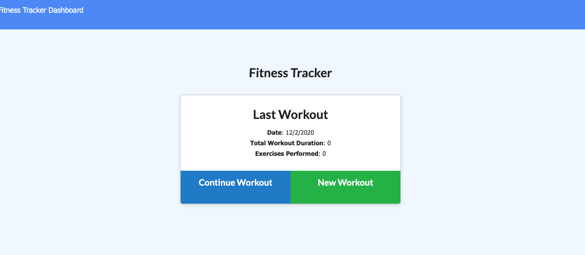

# Workout Tracker

### Deployed App
 - [Heroku App](https://fast-anchorage-21924.herokuapp.com/)

### Description: 
This application allows users to build new or upon existing workouts by adding exercises in a web application. Users can view, create and track daily workouts. They can log multiple exercises in a workout on a given day. They can also track the name, type, weight, sets, reps, and duration of exercises. If the exercise is a cardio exercise, they can track the distance traveled. Technologies include MongoDB, Mongoose, node.js, and route handling is implemented through Express. The application is deployed on Heroku and MongoDB Atlas.

# Table of Contents
- [Installation](https://github.com/qudoki/workout-tracker/blob/main/README.md#installation)
- [Usage](https://github.com/qudoki/workout-tracker/blob/main/README.md#usage)
- [Screenshots](https://github.com/qudoki/workout-tracker/blob/main/README.md#screenshots)
- [Tests](https://github.com/qudoki/workout-tracker/blob/main/README.md#usage)
- [Contributing](https://github.com/qudoki/workout-tracker/blob/main/README.md#contributions)
- [Questions](https://github.com/qudoki/workout-tracker/blob/main/README.md#questions)
- [License](https://github.com/qudoki/workout-tracker/blob/main/README.md#license)

## Installation:
- This package requires node.js if running locally. You can install the package dependencies by entering the following command: ""npm i"; otherwise it is deployed on Heroku.

## Usage:
- There is no testing for this package.

## Screenshots:

#### Home Page

#### Tracking Workouts

#### Charts

## Contributing:
- In most cases, please refer to this document: [Contributor Covenant](https://www.contributor-covenant.org/) 

- Please notify the repository holder if you'd like to contribute.

## Questions:
If you have any questions, please feel free to reach out via Github or email below.

- qudoki [Github Profile](https://github.com/qudoki)

### Contributors:
- <qdong327@gmail.com>

## License:

    Copyright 2020 Quinn Dong-Kilkenny

    Permission is hereby granted, free of charge, to any person obtaining a copy of this software and associated documentation files (the "Software"), to deal in the Software without restriction, including without limitation the rights to use, copy, modify, merge, publish, distribute, sublicense, and/or sell copies of the Software, and to permit persons to whom the Software is furnished to do so, subject to the following conditions:
    The above copyright notice and this permission notice shall be included in all copies or substantial portions of the Software.
    THE SOFTWARE IS PROVIDED "AS IS", WITHOUT WARRANTY OF ANY KIND, EXPRESS OR IMPLIED, INCLUDING BUT NOT LIMITED TO THE WARRANTIES OF MERCHANTABILITY, FITNESS FOR A PARTICULAR PURPOSE AND NONINFRINGEMENT. IN NO EVENT SHALL THE AUTHORS OR COPYRIGHT HOLDERS BE LIABLE FOR ANY CLAIM, DAMAGES OR OTHER LIABILITY, WHETHER IN AN ACTION OF CONTRACT, TORT OR OTHERWISE, ARISING FROM, OUT OF OR IN CONNECTION WITH THE SOFTWARE OR THE USE OR OTHER DEALINGS IN THE SOFTWARE.